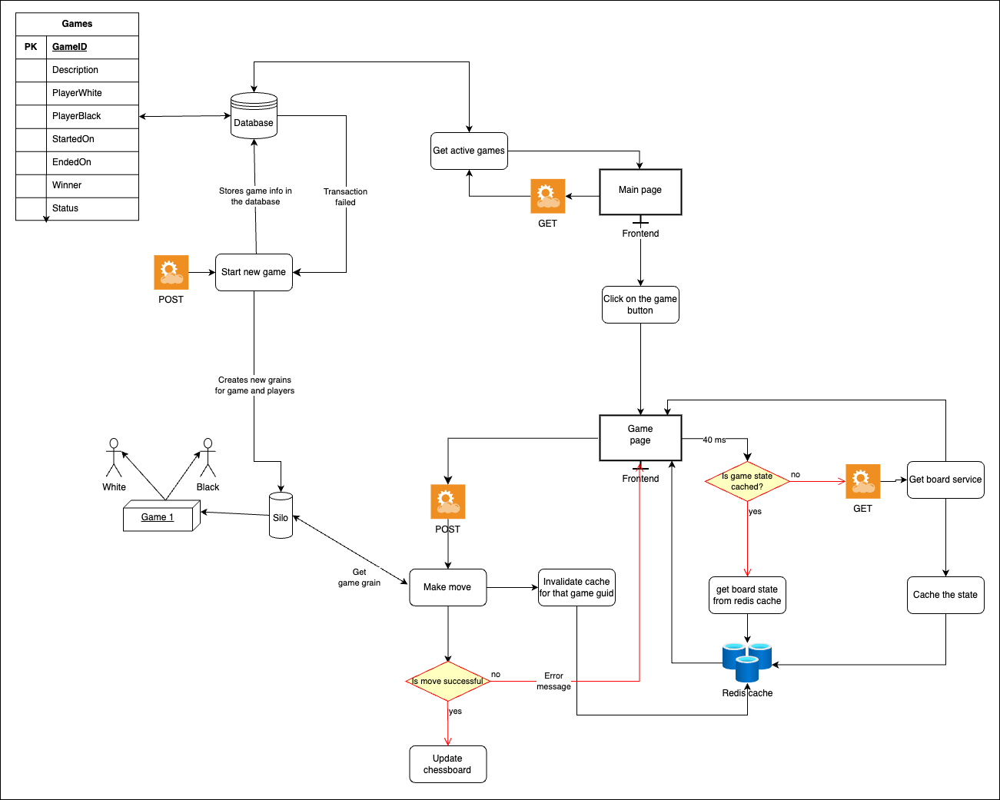

# Distributed Chess Website

## Overview
This project is a distributed web application that allows users to play chess online. It leverages several powerful technologies to create a scalable and performant system:

- **Microsoft Orleans**: An open-source framework for building distributed applications, used to implement the core game logic using the actor model.
- **Redis Cache**: Used to cache the chessboard state, enabling faster updates to the frontend.
- **Azure SQL Edge**: A lightweight, containerized database used to persistently store game information.
- **Hashicorp Vault**: Employed to securely store the database credentials.

By utilizing these technologies, the project aims to deliver a seamless and responsive online chess experience for users.

## Architecture

The distributed architecture of this project consists of several key components that are briefly shown in the following diagram



Let's now dive deeper into the various components.

### Players and Games
The player and game logic are implemented using Orleans grains. This allows for a scalable and fault-tolerant management of the game state, as each player and game instance is encapsulated as an independent actor.

### Frontend
The frontend is a simple web application that allows users to start a new game or join an existing one. It communicates with the backend using HTTP requests to retrieve the latest chessboard state and send user moves.

### Caching
To optimize performance, Redis cache is used to store the chessboard state. The frontend polls the backend every 40 milliseconds to retrieve the latest board state. By caching this data in-memory, the system can respond much faster, improving the overall user experience.  
The cache has a 5-minute expiration time and is invalidated whenever a new move is made, ensuring the data remains fresh and consistent.

### Database
The game information, such as player names, start and end dates, winner, and status, is stored in an Azure SQL Edge database. This dedicated data store separates the transactional game state (handled by the Orleans grains) from the more static player and game metadata.  
The database credentials are securely stored using Hashicorp Vault, following best practices for secure data management.

#### Database Schema

The database is structured to store essential game information effectively:

| Field          | Description                       |
|----------------|-----------------------------------|
| `GameID`       | Unique identifier for the game.   |
| `Description`  | Brief description of the game.    |
| `PlayerWhite`  | Name of the white player.         |
| `PlayerBlack`  | Name of the black player.         |
| `StartedOn`    | Timestamp for game initiation.    |
| `EndedOn`      | Timestamp for game conclusion.    |
| `Winner`       | Name of the winning player.       |
| `Status`       | Current game status.              |

## Getting Started

### Prerequisites
To run the project, ensure the following tools and services are installed:
- .NET 6 SDK
- Docker

### Steps to Run the Project

1. Clone the repository:
   ```bash
   git clone https://github.com/Meguazy/distributed_chess.git
   cd ChessSilo/
   ```

2. Start the Docker service:
   ```bash
   docker-compose up -d
   ```
   
3. Install the dependencies from the .csproj file:
   ```bash
   dotnet restore
   ```

4. Build the app:
   ```bash
   dotnet build
   export VAULT_TOKEN=secret_token
   export VAULT_ADDR='http://0.0.0.0:8200'
   vault secrets enable -path=database kv-v2
   vault kv put database/configs username="sa" password="4316"
   ```

5. Start the app:
   ```bash
   dotnet run
   ```

6. You can open the front end by navigating to:
   ```
   http://localhost:7164
   ```
   You will be automatically redirected to 

## License

This project is licensed under the Apache 2.0 License. For details, see the `LICENSE` file included in the repository.
